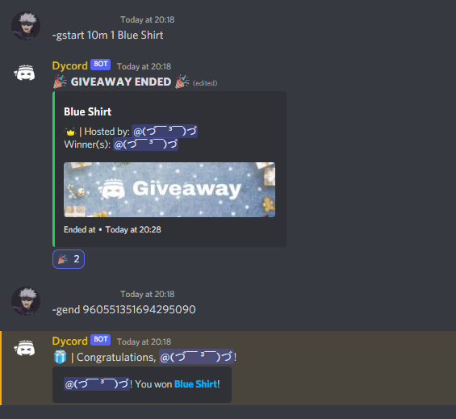

# Giveaway

### Giveaway Start

You can start giveaway by using `-gstart` command.

> **Usage:** -gstart \<time> \<number of winner> \<prize>

#### Example:

.png>)

#### Giveaway Start Options

<table><thead><tr><th align="center">Options</th><th align="center">Description</th><th data-type="checkbox">Required</th></tr></thead><tbody><tr><td align="center">time</td><td align="center">Time for giveaway to end</td><td>true</td></tr><tr><td align="center">winner count</td><td align="center">Number of winner should be chosen after giveaway ends</td><td>true</td></tr><tr><td align="center">prize</td><td align="center">Prize of giveaway</td><td>true</td></tr></tbody></table>

### Giveaway End

You can end a ongoing giveaway by using `-gend` command.

> **Usage:** -gend \<message id>

#### Example:

#### Giveaway End Options

<table><thead><tr><th align="center">Options</th><th align="center">Description</th><th data-type="checkbox">Required</th></tr></thead><tbody><tr><td align="center">message id</td><td align="center">Giveaway message's ID</td><td>true</td></tr></tbody></table>

### Giveaway Reroll

You can reroll new giveaway winner by using `-greroll` command.

> **Usage:** -greroll \<message id>

#### Example:

#### Giveaway Reroll Options

<table><thead><tr><th align="center">Options</th><th align="center">Description</th><th data-type="checkbox">Required</th></tr></thead><tbody><tr><td align="center">message id</td><td align="center">Giveaway message's ID</td><td>true</td></tr></tbody></table>

### Giveaway Edit

You can edit giveaway data by using `-gedit` command.

> **Usage:** -gedit \<message id> \[addtime/prize/winnercount] \<args>

#### _Example:_

Adding time:

Changing winner count:&#x20;

Changing prize:&#x20;

